# Project Architecture & Deployment Answers

### I. How are you planning to host these application components? [Marks = 5]

**1. Host Site**

Each component is deployed to a platform suited to its tech. Everything runs in a single AWS region, targeting 500 concurrent users.

| Component | Host | Notes |
|---|---|---|
| Frontend (Next.js) | Vercel | Native Next.js support, edge delivery, auto-deploys on push |
| All Go backend services - Auth, Workflow Engine, Workstation, Notification, Integration Gateway, Admin Dashboard | AWS ECS Fargate | Each runs as its own container so services scale independently; all sit inside a private VPC |
| AI/ML services (Python) - future | AWS ECS Fargate / SageMaker | Isolated from Go services; covers NLP Workflow Generator, Process Intelligence, Behavior-Aware Routing, and Digital Twin Simulation |
| Auth database | Supabase (managed PostgreSQL) | Handles users, roles, sessions, and JWT issuance. Note: Supabase is only the database here - the auth logic itself runs in the Go service |
| Workflow, Task, Notification & Audit data | MongoDB Atlas | Single cluster, separate collections per concern; suits the unstructured nature of workflow state and logs |

**2. Deployment Strategy**

1. Write a `Dockerfile` for each backend service so every service behaves the same in dev and production.
2. Set up Supabase (auth/users) and MongoDB Atlas (workflows, tasks, logs). Restrict DB access to the VPC - nothing external can reach them directly.
3. On every merge to `main`, GitHub Actions builds the container images and pushes them to AWS ECR.
4. ECS Fargate picks up the new image and redeploys that service independently. Each service gets its own environment variables (e.g., `SUPABASE_JWT_SECRET`, `MONGO_URI`, `ZOOM_API_KEY`).
5. An NGINX reverse proxy or AWS API Gateway sits at the public edge, routing requests to the right service by path prefix (`/api/workflow`, `/api/auth`, `/api/ai`, etc.).
6. Connect the repo to Vercel for the frontend. It reads environment variables for the API gateway URL and Supabase public keys, and rebuilds automatically on push.

**3. Security**

- On login, Supabase issues a signed JWT. Every backend service verifies it independently before doing anything - no service trusts a request without a valid token.
- Supabase Row Level Security (RLS) ensures users can only touch data from their own organization (multi-tenant isolation).
- All backend services run in a private VPC subnet with no public IP. The only internet-facing entry point is the API Gateway.
- All traffic is HTTPS/TLS end-to-end - browser, Vercel, API gateway, and databases.
- Third-party API credentials (Zoom, Google Forms, Gmail, WhatsApp) are stored in AWS Secrets Manager and injected only into the Integration Gateway container at runtime.

---

### II. How can your end users access these services (i.e., application components)?

Users - employees, managers, org admins, and analysts - open the platform in any web browser. The Next.js frontend on Vercel is their single entry point. Login goes directly to Supabase, which returns a JWT. From that point, every action the user takes (submitting a request, completing a task, viewing analytics) becomes an API call carrying that token to the API Gateway. The gateway validates the token and forwards the request to the right internal service. The Workflow Engine handles execution and triggers the Notification Service and Integration Gateway as needed. All future AI capabilities slot in behind the same gateway without changing anything else.

Pictorial Representation:

